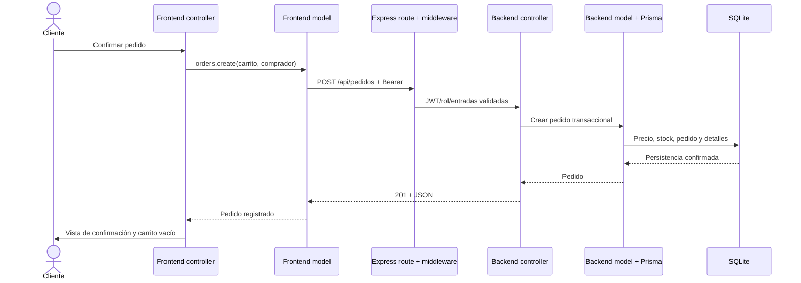

# Punto 1 — Arquitectura MVC

## Objetivo y método

Comprobar que el Reto 1 se transforma en una aplicación cliente-servidor con separación real de datos, renderizado y eventos. Se inspeccionaron dependencias entre módulos, estructura física, flujo HTTP y generación de pantallas, incluyendo el dashboard administrativo de estilo ERP. La prueba `tests/reto2/resources.test.cjs` verifica recursos y evita acceso Fetch/eventos en las vistas y consultas Prisma directas en los controladores del servidor. La suite Node actual contiene 20 pruebas y pasó; la verificación visual y de navegador se registra por separado en el informe 05 y en `docs/pruebas/reto2/`.

## Matriz de subpuntos

| Requisito | Implementación | Evidencia | Resultado |
|---|---|---|---|
| 1.1 `/frontend/models/` | `api.js`, `auth.js`, `catalog.js`, `cart.js`, `orders.js`, `admin.js` y validación ecuatoriana | Datos API, sesión y carrito independientes del renderizado; `administration.summary()` consulta el resumen protegido | Implementado |
| 1.1 `/frontend/views/` | `products.js`, `orders.js`, `admin.js`, `admin-dashboard.js`, `layout.js`, `common.js` | Tarjeta reutilizable, formularios, tablas, confirmación, diálogos y dashboard con SVG accesible | Implementado |
| 1.1 `/frontend/controllers/` | `app.js`, `catalog.js`, `account.js`, `checkout.js`, `admin.js`, `layout.js`, `contact.js` | Eventos y coordinación de modelos/vistas | Implementado |
| 1.1 `/frontend/assets/` | Estilos, fuentes, imágenes, iconos y `mvc.css` | Nueve HTML referencian recursos de esa carpeta | Implementado |
| 1.1 index semántico/accesible | `frontend/index.html` con header, nav, main, section, footer y salto al contenido | Test de recursos y navegador | Implementado |
| 1.2 `/server/routes/` | `routes/index.cjs` compone URL, middleware y controlador | Las rutas no contienen consultas Prisma ni cálculo del pedido | Implementado |
| 1.2 `/server/controllers/` | Controladores de auth, productos, pedidos, promociones, admin y `admin-summary.cjs` | Traducción de entradas validadas a servicios de modelo y respuestas HTTP; el controlador del resumen no consulta Prisma directamente | Implementado |
| 1.2 `/server/models/` | Acceso Prisma, transacción de pedido y `admin-summary.cjs` | Persistencia, consultas, precios, stock y agregados del dashboard centralizados | Implementado |
| 1.2 `/server/middleware/` | Auth, roles, validación, errores, logger; CORS en composición de app | Pipeline reutilizable en cada ruta | Implementado |
| 1.2 `/server/prisma/` | Schema, migración versionada y seed | Inicialización reproducible con `npm run setup` | Implementado |

## Flujo verificado

Los modelos del cliente publican señales en `models/events.js`, un EventTarget independiente del DOM. Los controladores escuchan las señales y actualizan las vistas. `scripts/build-frontend.cjs` reutiliza cabecera, pie, campos y diálogos al generar HTML; el comportamiento permanece en módulos MVC.

El administrador entra en `admin.html`, cuya vista inicial es el dashboard. El controlador `frontend/controllers/admin.js` solicita `administration.summary()`, el modelo cliente llama a `GET /api/admin/resumen` y la ruta aplica JWT y rol admin antes de invocar `server/controllers/admin-summary.cjs`. El modelo de servidor `server/models/admin-summary.cjs` obtiene un snapshot de la base de datos; `frontend/views/admin-dashboard.js` solo convierte ese resultado en tarjetas, alertas, estados, tendencia y pedidos recientes. Los estados de carga, error y reintento conservan esa separación.

El mismo controlador coordina las cinco tablas existentes mediante `?tabla=productos`, `promociones`, `pedidos`, `usuarios` o `detalles`. Los accesos rápidos a crear un producto o una promoción abren el editor del CRUD correspondiente. La plantilla del panel tiene sidebar, topbar y sesión propios; las páginas de carrito e historial personal redirigen a los administradores al panel, mientras el cliente conserva su compra y sus pedidos. No se agregaron pantallas de proveedores, nómina ni contabilidad.

## Hallazgos y cierre

1. La versión previa tenía cuentas y pedidos locales: reemplazados por API y base de datos en la aplicación de `frontend/`.
2. El carrito del reto previo usaba módulos globales: el nuevo carrito es un modelo ES independiente y publica cambios al controlador.
3. Renderizado repetido: tarjetas, precios, estados, tablas y formularios se centralizaron en las vistas y en las plantillas de construcción.
4. El Reto 1 se conserva en la raíz como antecedente. La aplicación evaluable del Reto 2 se ejecuta con `npm start`, que sirve exclusivamente `frontend/` y `/api`. No hay que abrir los HTML raíz para evaluar este reto.
5. El panel administrativo era una lista de registros con una cabecera similar a la tienda. Ahora tiene un espacio ERP independiente, resumen persistido y navegación por funciones administrativas, conservando los mismos modelos de productos, promociones, usuarios y pedidos.

## Límites

El frontend usa JavaScript puro con módulos ES y no requiere un bundler. El generador sobrescribe los nueve HTML generados: deben editarse sus plantillas para conservar cambios. El diseño ERP corresponde a las funciones actuales de la farmacia, sin implementar módulos adicionales del ERP de referencia. La existencia de MVC no demuestra por sí sola que una aplicación sea segura; la revisión de permisos está en el informe 04.
