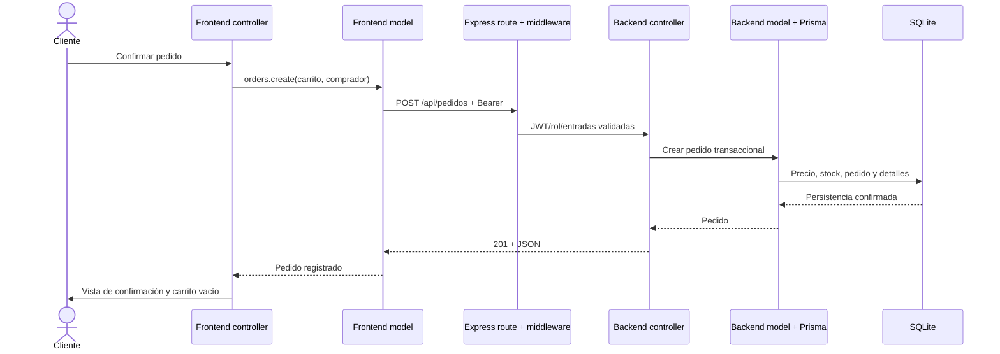

# Punto 1 — Arquitectura MVC

## Objetivo y método

Comprobar que el Reto 1 se transforma en una aplicación cliente-servidor con separación real de datos, renderizado y eventos. Se inspeccionaron dependencias, estructura, flujo HTTP, pantallas ERP, conexión entre sesiones, estados de pedidos, descuentos y carga de imágenes. `tests/reto2/resources.test.cjs` verifica recursos y evita Fetch/eventos en vistas y consultas Prisma directas en controladores. Las ejecuciones Node, navegador y auditoría de dependencias se registran en `docs/pruebas/reto2/`; los conteos corresponden a la última ejecución completa allí conservada.

## Matriz de subpuntos

| Requisito | Implementación | Evidencia | Resultado |
|---|---|---|---|
| 1.1 `/frontend/models/` | `api.js`, `auth.js`, `catalog.js`, `cart.js`, `orders.js`, `admin.js` y validación ecuatoriana | Datos API, sesión y carrito independientes del renderizado; `administration.summary()` consulta el resumen protegido | Implementado |
| 1.1 `/frontend/views/` | `products.js`, `orders.js`, `admin.js`, `admin-dashboard.js`, `layout.js`, `common.js` | Tarjeta reutilizable, formularios, tablas, confirmación, diálogos y dashboard con SVG accesible | Implementado |
| 1.1 `/frontend/controllers/` | `app.js`, `catalog.js`, `account.js`, `checkout.js`, `admin.js`, `layout.js`, `contact.js`, `updates.js`, `images.js` | Eventos, estados de pedidos, carga de imágenes y refresco de pantallas abiertas | Implementado |
| 1.1 `/frontend/assets/` | Estilos, fuentes, imágenes, iconos y `mvc.css` | Nueve HTML referencian recursos de esa carpeta | Implementado |
| 1.1 index semántico/accesible | `frontend/index.html` con header, nav, main, section, footer y salto al contenido | Test de recursos y navegador | Implementado |
| 1.2 `/server/routes/` | `routes/index.cjs` compone URL, middleware y controlador | Las rutas no contienen consultas Prisma ni cálculo del pedido | Implementado |
| 1.2 `/server/controllers/` | Controladores de auth, productos, pedidos, promociones, admin y `admin-summary.cjs` | Traducción de entradas validadas a servicios de modelo y respuestas HTTP; el controlador del resumen no consulta Prisma directamente | Implementado |
| 1.2 `/server/models/` | Acceso Prisma, pedidos, `prices.cjs`, `imagenes.cjs`, `backups.cjs`, `admin-summary.cjs` | Persistencia, precios efectivos, stock, historial, procesamiento de imágenes y recuperación | Implementado |
| 1.2 `/server/middleware/` | Auth, roles, validación, errores, logger; CORS en composición de app | Pipeline reutilizable en cada ruta | Implementado |
| 1.2 `/server/prisma/` | Schema, migraciones versionadas y seed con marca Semilla | Inicialización reproducible con `npm run setup`; reinstalar conserva las decisiones administrativas | Implementado |

## Flujo verificado

Los modelos del cliente publican señales en `models/events.js`, un EventTarget independiente del DOM. Los controladores escuchan las señales y actualizan las vistas. `scripts/build-frontend.cjs` reutiliza cabecera, pie, campos y diálogos al generar HTML; el comportamiento permanece en módulos MVC.

El administrador entra en `admin.html`, cuya vista inicial es el dashboard. El controlador `frontend/controllers/admin.js` solicita `administration.summary()`, el modelo cliente llama a `GET /api/admin/resumen` y la ruta aplica JWT y rol admin antes de invocar `server/controllers/admin-summary.cjs`. El modelo de servidor `server/models/admin-summary.cjs` obtiene un snapshot de la base de datos; `frontend/views/admin-dashboard.js` solo convierte ese resultado en tarjetas, alertas, estados, tendencia y pedidos recientes. Los estados de carga, error y reintento conservan esa separación.

El mismo controlador coordina las cinco tablas existentes mediante `?tabla=productos`, `promociones`, `pedidos`, `usuarios` o `detalles`. Los accesos rápidos a crear un producto o una promoción abren el editor del CRUD correspondiente. La plantilla del panel tiene sidebar, topbar y sesión propios; las páginas de carrito e historial personal redirigen a los administradores al panel, mientras el cliente conserva su compra y sus pedidos. No se agregaron pantallas de proveedores, nómina ni contabilidad.

## Conexión entre administración y tienda

El cliente y el administrador consultan las mismas entidades persistidas. Los cambios exitosos de productos, promociones y pedidos publican `data:changed` desde el modelo API; `models/events.js` guarda además un UUID en `farmacia-mvc-datos-actualizados` para avisar a otras pestañas del mismo origen. Esa señal no transporta datos de negocio ni credenciales: cada pantalla vuelve a consultar su API y sus permisos.

`controllers/updates.js` coordina refrescos al recuperar el foco, volver a estar visible, recibir la señal o cada 30 segundos mientras la página permanece visible. Evita consultas simultáneas del mismo watcher, agrupa un aviso pendiente y detiene sus listeners al abandonar la página. Los controladores comparan el resultado con la información mostrada y solo reconstruyen la zona que cambió; `preserveFocus` conserva el foco del control equivalente. Los filtros y formularios quedan fuera de esas zonas, y se pospone el refresco durante edición de cantidad, envío o diálogo abierto según la pantalla.

Los handlers de catálogo y detalle están delegados y consultan el producto actual antes de añadirlo al carrito. El checkout escucha también `cart:changed`, incluidos cambios de almacenamiento de otra pestaña, recalcula totales y bloquea continuar/confirmar si falta un producto o la cantidad supera el stock. El editor administrativo envía la versión original `esperadoUpdatedAt`; el modelo de servidor decide atómicamente si todavía corresponde al registro persistido.

Las aperturas asíncronas del editor de campañas tienen su propia secuencia `openingId`. Solo la última apertura de la sección todavía activa puede asignar el registro, su ID y sus opciones; una respuesta atrasada no mezcla el contenido visible de una campaña con el ID usado al guardar.

## Estados, precios e imágenes

El controlador administrativo coordina el diálogo de estado y llama al modelo cliente para `PUT /api/pedidos/:id/estado`. El controlador de servidor delega en `models/pedidos.cjs`: el modelo valida transición y versión, cambia el estado, registra al actor y devuelve unidades cuando se cancela, todo dentro de la misma transacción. Las vistas de pedidos del cliente y del administrador presentan el estado e historial recibidos; no determinan qué transición es válida en la base.

`server/models/prices.cjs` concentra la selección del mayor descuento elegible y el redondeo a centavos. Productos, campañas y creación de pedidos reutilizan ese cálculo; el frontend recibe el precio efectivo y conserva el precio base para mostrarlo tachado. Cada detalle mantiene su precio y descuento al comprar.

`frontend/controllers/images.js` gestiona selección, carga, aborto y vista previa. El modelo cliente envía una imagen a `/api/admin/imagenes`; autenticación, rol y validación se aplican antes del procesamiento. `server/models/imagenes.cjs` decodifica y recodifica con Sharp y publica un UUID WebP. Las vistas solo presentan la ruta resultante. Los respaldos son operaciones del servidor mediante `models/backups.cjs` y scripts CLI, fuera de las rutas comerciales.

## Hallazgos y cierre

1. La versión previa tenía cuentas y pedidos locales: reemplazados por API y base de datos en la aplicación de `frontend/`.
2. El carrito del reto previo usaba módulos globales: el nuevo carrito es un modelo ES independiente y publica cambios al controlador.
3. Renderizado repetido: tarjetas, precios, estados, tablas y formularios se centralizaron en las vistas y en las plantillas de construcción.
4. El Reto 1 se conserva en la raíz como antecedente. La aplicación evaluable del Reto 2 se ejecuta con `npm start`, que sirve exclusivamente `frontend/` y `/api`. No hay que abrir los HTML raíz para evaluar este reto.
5. El panel administrativo era una lista de registros con una cabecera similar a la tienda. Ahora tiene un espacio ERP independiente, resumen persistido y navegación por funciones administrativas, conservando los mismos modelos de productos, promociones, usuarios y pedidos.
6. Los datos quedaban fijados al cargar cada página. Ahora los controladores refrescan las vistas abiertas mediante la API sin reemplazar filtros ni formularios; el modelo del carrito notifica también cambios entre pestañas.

## Límites

El frontend usa JavaScript puro con módulos ES y no requiere un bundler. El generador sobrescribe los nueve HTML generados: deben editarse sus plantillas para conservar cambios. El diseño ERP corresponde a las funciones actuales de la farmacia, sin implementar módulos adicionales del ERP de referencia. La existencia de MVC no demuestra por sí sola que una aplicación sea segura; la revisión de permisos está en el informe 04.
