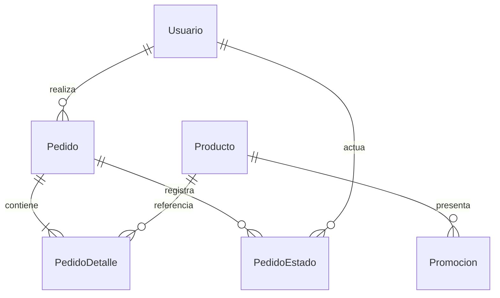

# Punto 2 — Persistencia relacional con Prisma

## Objetivo y método

Verificar entidades, relaciones, migraciones, seed, pedidos, estados, precios e imágenes persistidas. Las pruebas usan SQLite temporal, aplican las mismas migraciones de entrega y abren otro PrismaClient para comprobar persistencia. Se verificó además la migración commerce sobre filas anteriores y su integridad referencial. Los resultados completos se conservan en `docs/pruebas/reto2/`.

## Matriz de subpuntos

| Entidad / requisito 2.1 | Campos y relaciones | Evidencia | Resultado |
|---|---|---|---|
| Producto | `id`, `nombre`, `precio Decimal`, `stock Int`, `createdAt`; categoría, imagen, activo y actualización | Schema y CRUD HTTP | Implementado |
| Usuario | `id`, `email unique`, `passwordHash`, `role admin/user`; nombre, teléfono, activo y versión del token | Registro, bcrypt y login | Implementado |
| Pedido | `id`, `userId FK`, `total Decimal`, `createdAt`, `updatedAt`, estado, entrega y documento enmascarado | Pedido recuperado, transiciones e idempotencia | Implementado |
| PedidoDetalle | `id`, dos FK, cantidad, `precioUnitario`, `precioOriginal`, `descuentoPorcentaje` | Snapshot conservado tras cambiar producto/campaña | Implementado |
| Promocion | Producto FK, publicación, vista previa, vigencia, porcentaje, imagen/alt opcionales | API pública elegible y cálculo efectivo compartido | Implementado |
| PedidoEstado | Pedido y actor FK, estado anterior/nuevo y fecha | Historial inicial y transiciones administrativas; una sola cancelación | Implementado |
| Carrito frontend | Solo identificadores y cantidades en localStorage | Recarga del navegador conserva selección | Implementado |
| Pedido final en BD | Cabecera y detalles en una transacción Prisma | Pedido sigue existiendo con otro cliente de BD | Implementado |
| Motor relacional | SQLite, alternativa aceptada por el estudiante | `provider = "sqlite"` y archivo real | Implementado con motor alternativo |
| Migraciones y seed | `202610090001_init`, `202610090002_seed_marker`, `202610090003_commerce`, `seed.cjs` | Base nueva y migración histórica; seed conserva el estado administrativo | Implementado |
| Resumen administrativo | Agregados de Producto, Usuario, Pedido y Promocion ya persistidos | `server/models/admin-summary.cjs`, endpoint protegido y pruebas del resumen | Implementado sin nuevas entidades ni migraciones |
| Semilla | ID de inicialización y `createdAt`; sin datos personales ni exposición en las tablas del panel | Marca `catalogo-inicial-v1`, detección del catálogo previo y prueba de seed repetido | Implementado como metadato de instalación |
| Edición concurrente | `Producto.updatedAt` comparado con `esperadoUpdatedAt` | Una compra u otra edición invalida la versión y devuelve 409 sin restaurar stock anterior | Implementado en el editor administrativo |

## Modelo y consistencia



Se agregan campañas a `Promocion` para la administración solicitada previamente. La migración contiene claves primarias, foráneas e índices únicos para correo, detalles por producto y la clave de confirmación por usuario. Las relaciones usan Restrict para conservar el historial.

El servidor convierte precios a centavos para el cálculo y escribe el total con Prisma Decimal. Ignora precios de cliente porque el contrato del pedido solo acepta ID y cantidad. Un decremento condicionado por `stock >= cantidad`, dentro de una transacción serializable, impide sobreventa. Si falla cualquier línea, se revierte el pedido completo y el stock de todas las líneas.

La clave de confirmación se combina con el usuario y con una huella de la solicitud. Repetir exactamente el mismo pedido devuelve el existente; reutilizar la clave con otro contenido devuelve 409. La prueba simultánea de dos compras sobre una unidad produce una compra y un conflicto, manteniendo stock cero.

Los detalles guardan nombre y precio al comprar. Eliminar un producto lo desactiva y lo retira de nuevas compras, sin borrar detalles históricos. En una base nueva, el seed crea los 18 productos iniciales con stock de demostración y dos campañas de vista previa. La tabla Semilla marca esa inicialización con `catalogo-inicial-v1`: ejecutarlo de nuevo no vuelve a crear campañas eliminadas, reactivar productos, restaurar stock ni modificar contraseñas existentes.

La migración `202610090002_seed_marker` agrega únicamente ese metadato. Para adoptar una base creada antes de la marca, el seed detecta la presencia de IDs del catálogo inicial, conserva su estado y escribe la marca sin volver a insertar las campañas. La marca y la inicialización ocurren en una transacción Serializable. El administrador configurado se crea solo si no existe; si ese correo pertenece a un cliente, se rechaza la inicialización en lugar de elevar su rol.

El editor de productos conserva `updatedAt` al abrir y envía `esperadoUpdatedAt` al guardar. El modelo ejecuta `updateMany` condicionado por ID, producto activo y versión exacta dentro de una transacción Serializable. Si una compra descontó stock o un administrador cambió el registro entretanto, no actualiza ninguna fila y responde 409. Esto evita que guardar un precio desde un formulario antiguo restaure unidades vendidas. El campo de versión es opcional en el contrato HTTP por compatibilidad; el frontend de esta entrega lo incluye en todas las ediciones de producto.

## Estados y descuentos históricos

Las transiciones son pendiente → confirmado/cancelado, confirmado → preparado/cancelado y preparado → entregado/cancelado. Entregado y cancelado son terminales. El administrador envía la versión obligatoria del pedido; el modelo compara estado y `updatedAt` mediante una actualización condicional. Cancelar devuelve las cantidades de cada detalle al producto referido y agrega un único evento al historial dentro de la misma transacción Serializable. Repetir el estado ya alcanzado devuelve el pedido existente, sin otra devolución ni otro evento. La prueba concurrente cancela el mismo pedido desde dos solicitudes y conserva el stock correcto tras reconectar.

Una promoción descuenta solo si está activa, vigente, fuera de vista previa, asociada a producto activo y con porcentaje entre 1 y 90. Entre varias se elige el mayor porcentaje; no se suman. Inicio es inclusivo y fin exclusivo. El precio se calcula y redondea por unidad en centavos (USD 7,50 con 25% queda en USD 5,63). El catálogo y el pedido reutilizan `prices.cjs`; el pedido guarda precio efectivo, precio original y porcentaje. Cambiar o eliminar la campaña no altera un pedido ya registrado ni su repetición idempotente.

La migración commerce conserva las filas anteriores, agrega `Pedido.updatedAt` tomando su `createdAt`, completa `PedidoDetalle.precioOriginal` con el precio histórico y deja su descuento en cero. No inventa cambios logísticos anteriores: los pedidos previos empiezan a acumular historial con su siguiente transición. La prueba de conversión conserva IDs, totales, cantidades, credenciales, stock, campañas y claves de reintento, y comprueba `PRAGMA foreign_key_check`.

La aplicación de esta migración en la base de trabajo se realizó con respaldo privado previo. Se cotejó SHA-256 de los campos originales de Producto, Usuario, Pedido, PedidoDetalle y Promocion antes/después, sin cambios en esos datos, y se verificó integridad. La copia y las credenciales no se incorporan a estos informes ni a la entrega.

## Respaldo y recuperación

`models/backups.cjs` usa `VACUUM INTO` para una copia SQLite consistente, que incluye las entidades, historial, marca de seed y metadatos de migración. Copia también las imágenes UUID referidas por Producto y Promocion. Cada carpeta privada de `server/backups/` contiene base, imágenes y un manifiesto con tamaños y SHA-256; se verifican `integrity_check`, claves foráneas y referencias. La copia se publica después de completarse y conserva las siete más recientes. Fuera de test se ejecuta al arrancar el servidor y cada 24 horas mientras permanece activo.

`npm run backup` crea una copia manual. La restauración requiere servidor detenido y `npm run backup:restore -- --from "carpeta-del-respaldo" --offline`; si la base destino existe exige además `--replace` y genera primero una copia de ella. Se validan archivos/manifiesto y la integridad antes de publicar la base. Las imágenes usan UUID inmutable; si un archivo existente difiere, se rechaza en lugar de sobrescribirlo. Pruebas temporales verifican recuperación de usuarios/hash/versiones, pedidos/detalles/historial, imágenes y retención; no sustituyen una restauración operativa en el servidor desplegado.

Cuando el destino tiene corrupción SQLite identificada, se conserva una copia cruda de DB y WAL/SHM existentes antes de publicar el respaldo válido. Se prepara en `.recovery-UUID` y se publica como `recovery-FECHA-UUID` bajo el mismo directorio privado. Su manifiesto indica `motor: sqlite-unreadable`, `tipo: recuperacion-forense` y `restaurable: false`, junto con tamaños y SHA-256 de los bytes conservados. Estas copias quedan para revisión y no reciben poda automática. Errores de permisos, espacio o rutas de imágenes no se tratan genéricamente como corrupción; si la copia previa falla, no se reemplaza el destino. La novena prueba de imágenes/respaldos comprueba bytes exactos de los tres archivos, restauración de usuarios/pedidos/stock y rechazo ante un archivo WAL que no puede copiarse de forma segura.

## Snapshot del dashboard ERP

`server/models/admin-summary.cjs` realiza una transacción Prisma de lectura con aislamiento `Serializable`. Los conteos, sumas, alertas y listas pertenecen al mismo snapshot de la base de datos. El resumen no usa valores de muestra ni registra una segunda copia de la información.

- Los pedidos se agrupan por estado con `groupBy`; `_sum.total` se convierte desde Prisma Decimal a centavos enteros y se verifica que cada total quede dentro del rango seguro. El importe acumulado es la suma de los pedidos registrados, incluidos los estados existentes; no representa pagos recibidos ni facturación fiscal.
- La tendencia contiene seis meses calendario, incluido el actual. Sus límites se calculan para `America/Guayaquil` (UTC−5): desde la medianoche local del primer día hasta el inicio del mes siguiente, con límite final exclusivo. La tarjeta del mes usa el último período de esa tendencia.
- Productos, clientes y administradores se cuentan solo si están activos. Las alertas incluyen productos activos con stock menor o igual a cinco; la lista muestra como máximo diez, ordenados por stock, nombre e ID, y el conteo conserva el total real aunque haya más alertas.
- Los pedidos recientes son los cinco más nuevos, con desempate por ID. La consulta selecciona únicamente ID, nombre del comprador, importe, estado y fecha para esta sección.
- Las campañas visibles deben estar activas, referenciar un producto activo y cumplir su vigencia: inicio nulo o ya alcanzado; fin nulo o posterior al instante del resumen. Las campañas de vista previa se incluyen porque también son visibles en la tienda.

No se alteró el schema ni se añadió una migración para el dashboard: todas sus consultas usan las entidades y relaciones existentes. La migración posterior de Semilla corresponde al control de inicialización. El snapshot se vuelve a solicitar al entrar, reintentar, recuperar el foco o cada 30 segundos mientras el panel permanece visible; no se usa una conexión de eventos en tiempo real.

## Evidencia reproducible

```powershell
npm ci
npm run setup
npm test
```

Casos específicos: registro con hash, CRUD persistido, total servidor, pedido con detalles, reversión por stock, concurrencia, conservación histórica, reapertura de BD, resumen administrativo, edición con versión vencida y repetición del seed conservando campañas eliminadas y credenciales. La prueba de reconexión comprueba conjuntamente usuario, producto editado, campaña, pedido, detalles y stock. El archivo de trabajo es `server/prisma/farmacia.db`, excluido de Git y ZIP; la entrega incluye schema, SQL y seed para reconstruirlo.

## Hallazgos y límites

- Cerrado: el pedido anterior desaparecía fuera del navegador; ahora pertenece al usuario y persiste en BD.
- Cerrado: el total podía venir del cliente; ahora se obtiene exclusivamente del catálogo persistido.
- Cerrado: reintentos podían descontar stock más de una vez; se incorporó idempotencia y prueba de repetición.
- Cerrado: el panel no tenía una vista agregada de la operación; el dashboard ahora obtiene métricas, alertas y pedidos desde un snapshot relacional sin mantener totales paralelos.
- Cerrado: una edición abierta podía restaurar stock anterior a una compra; el editor envía la versión y el modelo rechaza el conflicto sin modificar la fila.
- Cerrado: repetir setup podía recrear una campaña inicial eliminada; la marca de seed conserva el catálogo existente y adopta bases anteriores sin duplicarlo.
- El PUT sin `esperadoUpdatedAt` conserva la compatibilidad del contrato previo y no aplica el control de versión. Los consumidores externos que quieran proteger sus ediciones deben enviar ese campo.
- SQLite tiene un solo escritor concurrente; una operación a mayor escala requiere evaluar un motor servidor y migración explícita. El respaldo implementado es local: no hay copia externa, cifrado ni protección frente a pérdida del disco completo. Cambiar solo DATABASE_URL no cambia el proveedor.
- SQL Server no se instaló ni se presenta como probado. Se implementó el motor alternativo autorizado.
