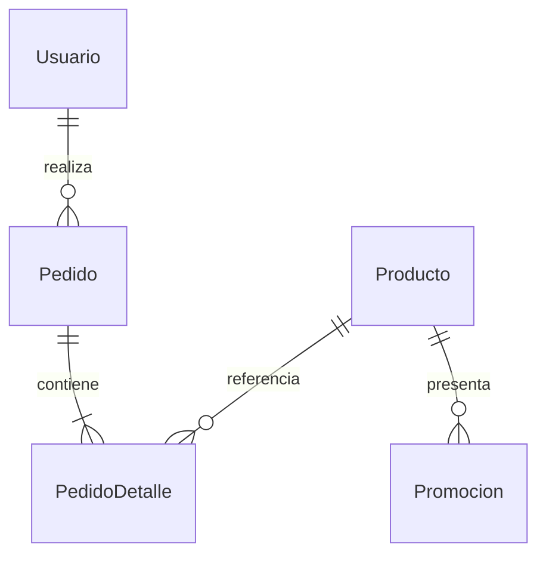

# Punto 2 — Persistencia relacional con Prisma

## Objetivo y método

Verificar entidades, relaciones, migraciones, seed y almacenamiento real del pedido, además de la coherencia del resumen administrativo. Se ejecutó `prisma migrate deploy`, se inicializó el catálogo y se hicieron consultas desde Prisma y HTTP. Las pruebas usan SQLite temporal, aplican la misma migración de entrega y vuelven a abrir el archivo con otro PrismaClient para comprobar persistencia. La suite Node actual contiene 20 pruebas y pasó, incluyendo la incorporación del resumen ERP.

## Matriz de subpuntos

| Entidad / requisito 2.1 | Campos y relaciones | Evidencia | Resultado |
|---|---|---|---|
| Producto | `id`, `nombre`, `precio Decimal`, `stock Int`, `createdAt`; categoría, imagen, activo y actualización | Schema y CRUD HTTP | Implementado |
| Usuario | `id`, `email unique`, `passwordHash`, `role admin/user`; nombre, teléfono, activo y versión del token | Registro, bcrypt y login | Implementado |
| Pedido | `id`, `userId FK`, `total Decimal`, `createdAt`; entrega, comprador y documento enmascarado | POST pedidos y reapertura de BD | Implementado |
| PedidoDetalle | `id`, `pedidoId FK`, `productoId FK`, `cantidad`, `precioUnitario Decimal` | Pedido recuperado con detalles | Implementado |
| Carrito frontend | Solo identificadores y cantidades en localStorage | Recarga del navegador conserva selección | Implementado |
| Pedido final en BD | Cabecera y detalles en una transacción Prisma | Pedido sigue existiendo con otro cliente de BD | Implementado |
| Motor relacional | SQLite, alternativa aceptada por el estudiante | `provider = "sqlite"` y archivo real | Implementado con motor alternativo |
| Migraciones y seed | `server/prisma/migrations/202610090001_init/migration.sql`, `seed.cjs` | Instalación desde BD vacía | Implementado |
| Resumen administrativo | Agregados de Producto, Usuario, Pedido y Promocion ya persistidos | `server/models/admin-summary.cjs`, endpoint protegido y pruebas del resumen | Implementado sin nuevas entidades ni migraciones |

## Modelo y consistencia



Se agregan campañas a `Promocion` para la administración solicitada previamente. La migración contiene claves primarias, foráneas e índices únicos para correo, detalles por producto y la clave de confirmación por usuario. Las relaciones usan Restrict para conservar el historial.

El servidor convierte precios a centavos para el cálculo y escribe el total con Prisma Decimal. Ignora precios de cliente porque el contrato del pedido solo acepta ID y cantidad. Un decremento condicionado por `stock >= cantidad`, dentro de una transacción serializable, impide sobreventa. Si falla cualquier línea, se revierte el pedido completo y el stock de todas las líneas.

La clave de confirmación se combina con el usuario y con una huella de la solicitud. Repetir exactamente el mismo pedido devuelve el existente; reutilizar la clave con otro contenido devuelve 409. La prueba simultánea de dos compras sobre una unidad produce una compra y un conflicto, manteniendo stock cero.

Los detalles guardan nombre y precio al comprar. Eliminar un producto lo desactiva y lo retira de nuevas compras, sin borrar detalles históricos. El seed crea los 18 productos iniciales con stock de demostración y dos campañas de vista previa; ejecutarlo de nuevo conserva ediciones y no restaura stock vendido ni modifica contraseñas existentes.

## Snapshot del dashboard ERP

`server/models/admin-summary.cjs` realiza una transacción Prisma de lectura con aislamiento `Serializable`. Los conteos, sumas, alertas y listas pertenecen al mismo snapshot de la base de datos. El resumen no usa valores de muestra ni registra una segunda copia de la información.

- Los pedidos se agrupan por estado con `groupBy`; `_sum.total` se convierte desde Prisma Decimal a centavos enteros y se verifica que cada total quede dentro del rango seguro. El importe acumulado es la suma de los pedidos registrados, incluidos los estados existentes; no representa pagos recibidos ni facturación fiscal.
- La tendencia contiene seis meses calendario, incluido el actual. Sus límites se calculan para `America/Guayaquil` (UTC−5): desde la medianoche local del primer día hasta el inicio del mes siguiente, con límite final exclusivo. La tarjeta del mes usa el último período de esa tendencia.
- Productos, clientes y administradores se cuentan solo si están activos. Las alertas incluyen productos activos con stock menor o igual a cinco; la lista muestra como máximo diez, ordenados por stock, nombre e ID, y el conteo conserva el total real aunque haya más alertas.
- Los pedidos recientes son los cinco más nuevos, con desempate por ID. La consulta selecciona únicamente ID, nombre del comprador, importe, estado y fecha para esta sección.
- Las campañas visibles deben estar activas, referenciar un producto activo y cumplir su vigencia: inicio nulo o ya alcanzado; fin nulo o posterior al instante del resumen. Las campañas de vista previa se incluyen porque también son visibles en la tienda.

No se alteró el schema ni se añadió una migración para el dashboard: todas las consultas usan las entidades y relaciones existentes. El snapshot se vuelve a solicitar al entrar o reintentar la vista; no hay sincronización en tiempo real.

## Evidencia reproducible

```powershell
npm ci
npm run setup
npm test
```

Casos específicos: registro con hash, CRUD persistido, total servidor, pedido con detalles, reversión por stock, concurrencia, conservación histórica, reapertura de BD y resumen administrativo de la información persistida. El archivo de trabajo es `server/prisma/farmacia.db`, excluido de Git y ZIP; la entrega incluye schema, SQL y seed para reconstruirlo.

## Hallazgos y límites

- Cerrado: el pedido anterior desaparecía fuera del navegador; ahora pertenece al usuario y persiste en BD.
- Cerrado: el total podía venir del cliente; ahora se obtiene exclusivamente del catálogo persistido.
- Cerrado: reintentos podían descontar stock más de una vez; se incorporó idempotencia y prueba de repetición.
- Cerrado: el panel no tenía una vista agregada de la operación; el dashboard ahora obtiene métricas, alertas y pedidos desde un snapshot relacional sin mantener totales paralelos.
- SQLite es suficiente para la entrega y tiene un solo escritor concurrente; la operación a mayor escala requerirá evaluar un motor servidor, copias de seguridad y migración explícita. Cambiar solo DATABASE_URL no cambia el proveedor.
- SQL Server no se instaló ni se presenta como probado. Se implementó el motor alternativo autorizado.
